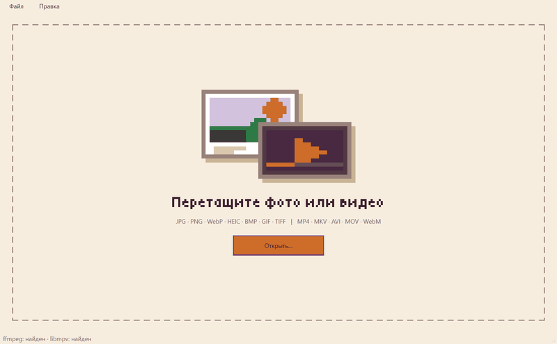
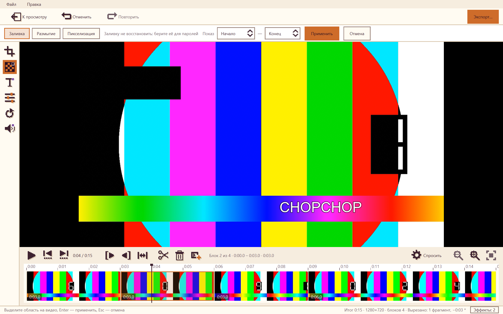
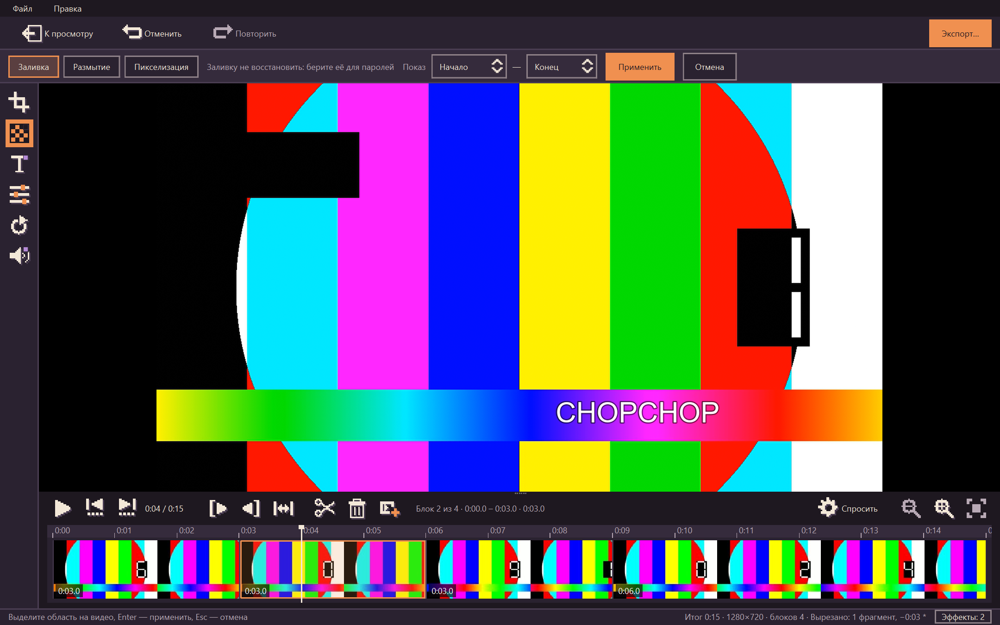
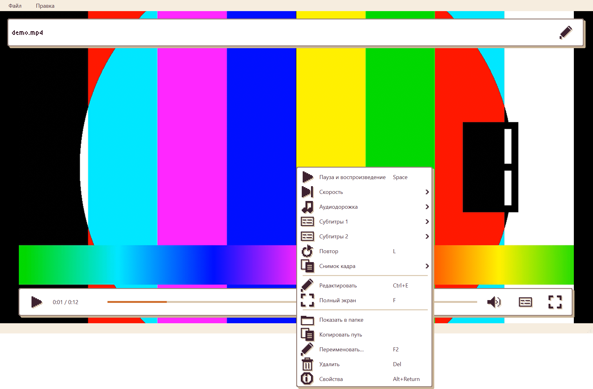
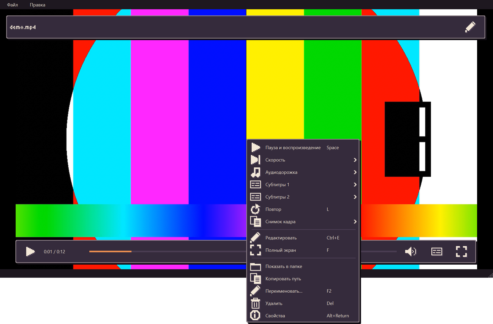
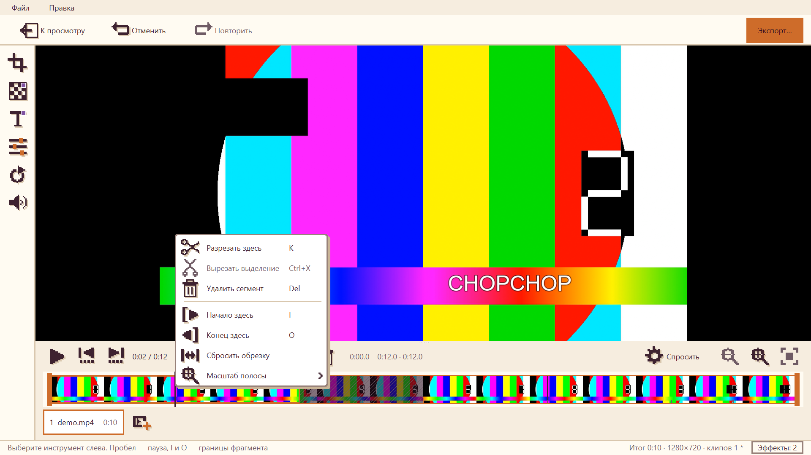
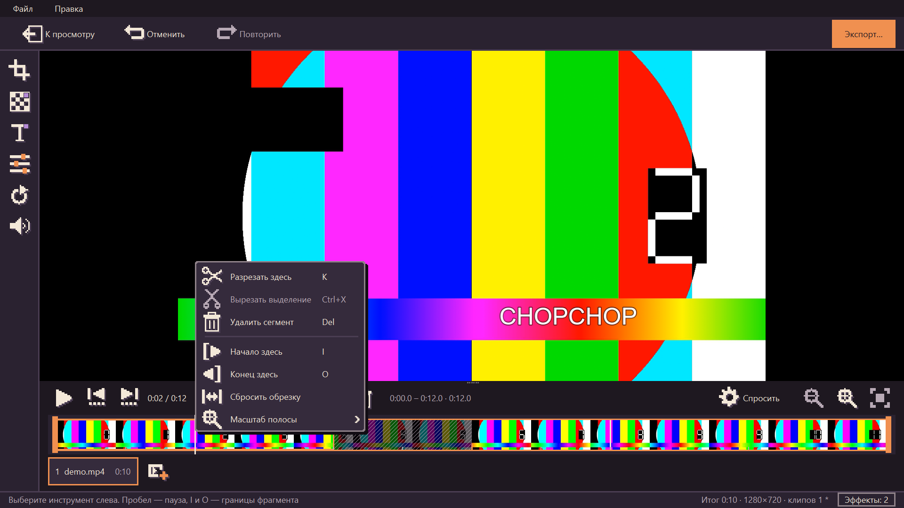

# CHOPCHOP

Лёгкий просмотрщик фото и плеер видео со встроенным режимом быстрого редактирования.
Открыл файл, посмотрел, при необходимости поправил и сохранил. Офлайн, бесплатно, без водяных знаков,
регистрации и телеметрии; исходный файл никогда не меняется. Windows и Linux.



## Что умеет

- **Фото:** JPG, PNG, WebP, BMP, GIF, TIFF и HEIC; листание папки стрелками, масштаб, полный экран.
- **Видео:** почти любые форматы, выбор аудиодорожки, субтитры 1 и 2 одновременно с настраиваемым
  оформлением, внешние .srt и .ass, сдвиг субтитров, запоминание позиции.
- **Редактор фото:** кадрирование с пропорциями, поворот, скрытие области (заливка, пикселизация,
  размытие), кисть и маркер, стрелка, текст, цвет и фильтры, изменение размера, отмена и повтор.
- **Редактор видео:** разрез и **вырезание из середины**, склейка клипов, громкость и замена звука,
  скрытие области и текст **со временем показа**, цвет и фильтры, поворот. Быстрый экспорт без
  потери качества или точный с перекодированием.
- **Контекстное меню** по правой кнопке на каждом экране с открытым файлом: копировать, показать в
  папке, переименовать, удалить в корзину, свойства, снимок кадра.
- **Оформление:** светлая и тёмная темы, четыре акцента, русский и английский интерфейс, подробные
  настройки ([`docs/settings.md`](docs/settings.md)). Всё переключается на лету.
- Метаданные (EXIF, GPS, место съёмки) при сохранении удаляются.

### Скриншоты

| Светлая тема | Тёмная тема |
| --- | --- |
|  |  |
|  |  |
|  |  |

## Установка

Готовые сборки — на странице [Releases](https://github.com/keishsjsk/chopchop/releases).

| Система | Файл | Как пользоваться |
| --- | --- | --- |
| Windows 10/11 | `CHOPCHOP-<версия>-setup.exe` | Установщик без прав администратора. Программа появится в «Открыть с помощью» для фото и видео. |
| Windows | `CHOPCHOP-<версия>-win64-portable.zip` | Распаковать и запустить `CHOPCHOP.exe`, ничего не устанавливается. |
| Linux x86_64 | `CHOPCHOP-<версия>-x86_64.AppImage` | `chmod +x CHOPCHOP-*.AppImage && ./CHOPCHOP-*.AppImage`. Нужен glibc не старше сборочного (Ubuntu 24.04 и новее). |

ffmpeg и libmpv уже внутри сборок. Контрольные суммы — в файле `SHA256SUMS.txt` релиза.
Windows может показать предупреждение SmartScreen: сборки пока не подписаны сертификатом.

Запуск из командной строки: `CHOPCHOP.exe путь\к\файлу`, версия — `--version`.

## Клавиши плеера

Пробел — пауза, ←/→ — перемотка на 5 с, ↑/↓ — громкость, A — следующая аудиодорожка,
S и Shift+S — субтитры 1 и 2, Z/X и Shift+Z/Shift+X — сдвиг субтитров 1 и 2 на 100 мс,
F — полный экран. Файл .srt/.ass можно перетащить на окно во время просмотра.

Общие: правая кнопка мыши (или Menu, Shift+F10) — контекстное меню, Ctrl+E — редактор,
F2 — переименовать, Delete — в корзину, Alt+Enter — свойства, Ctrl+C — копировать
изображение (в плеере кадр). Полный список действий и клавиш виден в меню.

## Редактор фото

Ctrl+E — перейти в редактор из просмотра фото (и обратно), Ctrl+V — открыть картинку из буфера обмена.
Исходный файл не меняется: результат сохраняется рядом как `имя_edited.jpg`.

| Клавиша | Действие |
| --- | --- |
| C | кадрировать: рамка сразу по всему кадру, тяните края и углы; список пропорций (1:1, 4:3, 3:2, 16:9 …) и кнопка ⇄ для поворота пропорций |
| R | повернуть и отразить |
| B | скрыть область: заливка (по умолчанию), пикселизация, размытие |
| D | кисть и маркер (рисуются мышью от руки и применяются сразу), стрелка, рамка, выделение области |
| T | текст: ввести, кликнуть на фото |
| Enter / Esc | применить / отменить действие (Esc без выделения — назад к просмотру) |
| Ctrl+Z / Ctrl+Y | отменить / повторить |
| Ctrl+S | быстро сохранить, Ctrl+Shift+S — выбрать формат, качество и метаданные |
| Ctrl+C | копировать результат в буфер обмена |

Размытие и пикселизацию текста можно частично восстановить, для паролей и номеров используйте заливку.

## Редактор видео

Ctrl+E на видео открывает редактор, Esc или «К просмотру» — возврат. Исходный файл не меняется,
результат сохраняется новым файлом `имя_edited.mp4` (Ctrl+S или «Экспорт…»).

- Полоса обрезки с миниатюрами: жёлтые границы тянутся мышью или ставятся на текущую позицию
  (I и O). K разрезает на текущей позиции, Delete убирает выбранный сегмент, Shift + выделение и
  Ctrl+X вырезают диапазон из середины. Вырезанное остаётся «призраком» (штриховка), клик возвращает.
  Превью перепрыгивает вырезы. Подробности: [`docs/cutting.md`](docs/cutting.md).
- Склейка: «Добавить клип…»; порядок меняется перетаскиванием чипов.
- Звук: громкость до 200%, «Убрать звук», «Заменить звук…» своим файлом.
- Эффекты (инструменты слева): кадр (C), скрытие области (B), текст (T), цвет и фильтры, поворот.
  Текст и скрытие области показываются на весь ролик или в выбранном окне времени; окно хранится во
  времени итога и пересчитывается при вырезании. Эффекты видны в превью.
- Клипы с разными параметрами (размер, частота кадров, кодек) тоже склеиваются: всё приводится
  к кадру первого клипа с чёрными полями, звуку недостающих клипов добавляется тишина.
- Экспорт идёт **без перекодирования видео**, пока нет эффектов и склейки разных роликов:
  он занимает секунды и не теряет качество. Резать в этом режиме можно только по ключевым кадрам,
  начало может сдвинуться на долю секунды. Галочка «Точная обрезка» и эффекты включают
  перекодирование (H.264): границы точны до кадра, но экспорт дольше, виден прогресс, есть отмена.
  Звук перекодируется (AAC) только при смене громкости, замене дорожки или перекодировании.

## Разработка

```bash
python -m venv .venv
.venv/Scripts/activate        # Linux: source .venv/bin/activate
pip install -e ".[dev]"
python -m chopchop [путь к файлу]
```

Проверки:

```bash
ruff check . && ruff format --check .
mypy
pytest
python -m chopchop --self-check      # всё ли нужное найдено: Qt, Pillow, ffmpeg, libmpv
```

При разработке программа ищет `ffmpeg`, `ffprobe` и `libmpv` сначала в `resources/bin`, затем в системе (PATH):

- Windows: положите `ffmpeg.exe`, `ffprobe.exe` и `libmpv-2.dll` в `resources/bin`
  (`python packaging/fetch_binaries.py --platform windows --out resources` скачает их с проверкой SHA-256).
- Linux: `sudo apt install ffmpeg libmpv2`.

Без ffmpeg не работают редактор видео и тесты видео (они пропускаются), без libmpv — плеер.

## Сборка релиза

```bash
pip install -e ".[build]"
powershell -File packaging/build_windows.ps1     # папка, портативный zip и установщик (нужен Inno Setup 6)
bash packaging/build_appimage.sh                 # AppImage (Linux, нужен libmpv2)
```

Скрипты скачивают зафиксированные версии ffmpeg и libmpv с проверкой контрольных сумм, собирают
программу PyInstaller (режим папки), проверяют собранный результат командой `--self-check` и упаковывают.
Релиз выпускается по тегу: `git tag v0.2.0 && git push origin v0.2.0`; GitHub Actions
(`.github/workflows/release.yml`) собирает установщик, zip и AppImage, прикладывает SBOM
(`sbom.cdx.json`) и `SHA256SUMS.txt`, а заметки берёт из `CHANGELOG.md`.

Значок приложения рисует `packaging/make_icon.py`, демо-GIF записывает `docs/make_demo.py`,
скриншоты редактора и меню — `docs/design/make_editor_screens.py` и `make_menu_screens.py`.

## Документация

[`docs/architecture.md`](docs/architecture.md) — устройство программы,
[`docs/performance.md`](docs/performance.md) — бюджеты и замеры,
[`docs/cutting.md`](docs/cutting.md) — резка видео, [`docs/subtitles.md`](docs/subtitles.md) — субтитры,
[`docs/settings.md`](docs/settings.md) — все настройки,
[`docs/checklist.md`](docs/checklist.md) — ручная проверка перед релизом (Windows, X11, Wayland).

## Лицензия

GNU GPL версии 3 или новее (`LICENSE`). Сторонние компоненты — в `THIRD_PARTY_NOTICES.md`.
